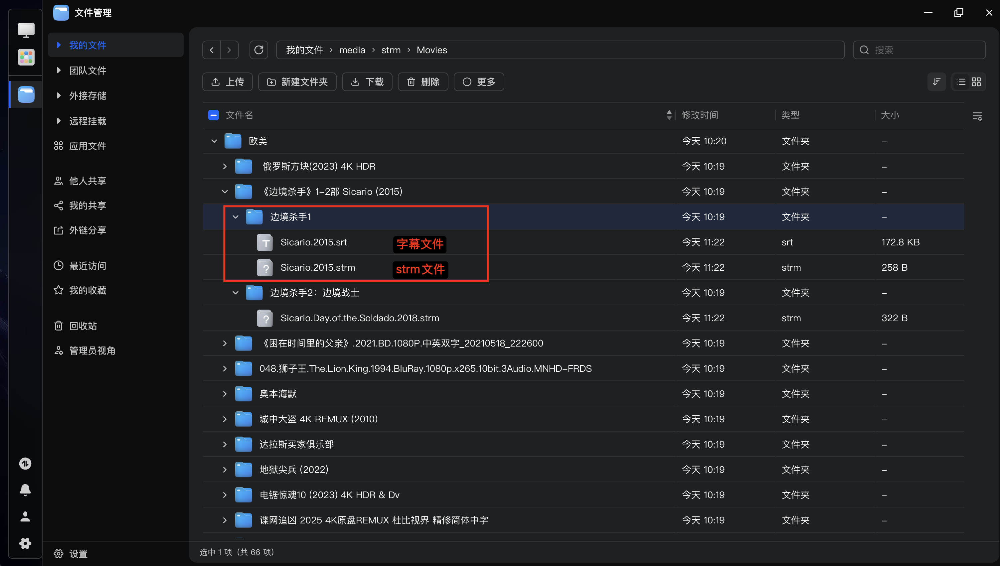
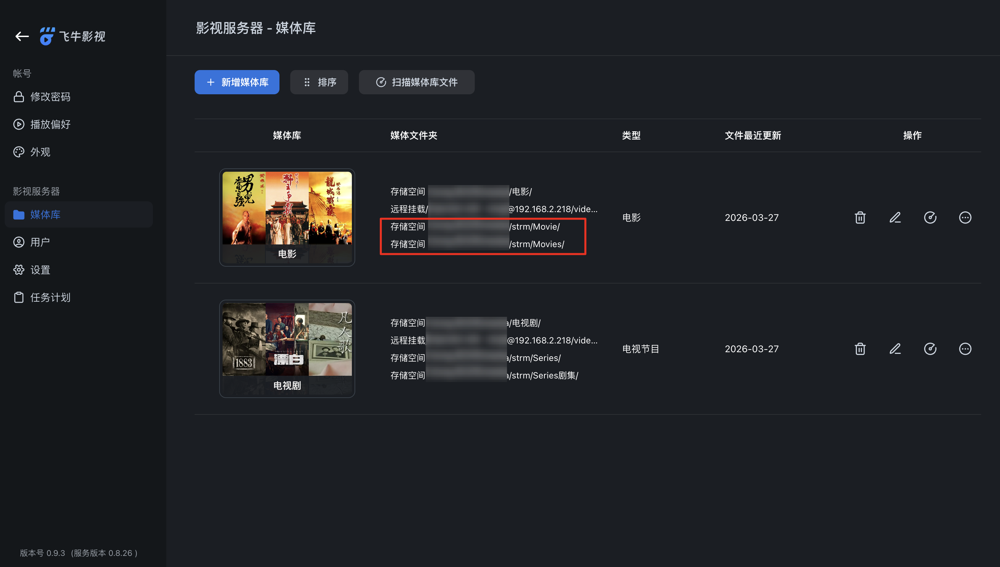
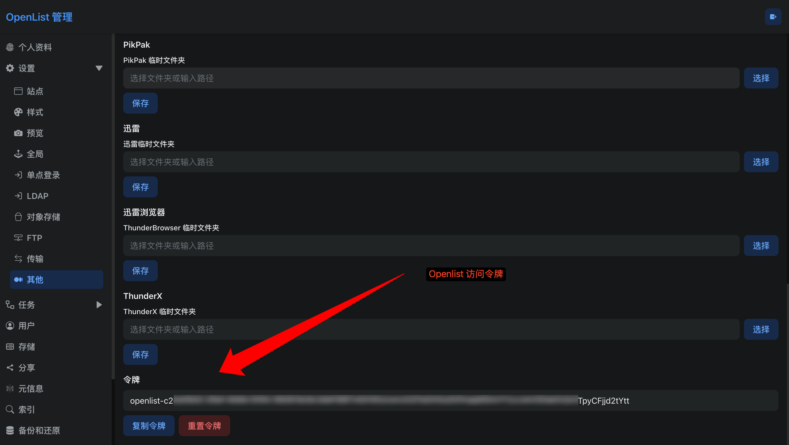

# Openlist STRM Generator & SMB Sync (openlist-strm-go)

这是一个使用 Go 语言编写的轻量级、高性能后台工具。它主要用于扫描 Openlist（或 Alist 等兼容 API）的网盘挂载目录，自动为视频文件生成 `.strm` 播放引导文件，并同步下载同名字幕。此外，它还内置了 SMB 客户端，能够将生成的本地数据单向镜像同步到 NAS 或其他 SMB 共享目录中。

**适用场景**：完美配合 Emby / Jellyfin / Plex / 飞牛影视 等媒体服务器，实现“本地零存储，云端秒播”的观影体验。

---

## 💡 为什么需要 `.strm` 文件？（特别是 115 网盘用户）

传统的做法是将网盘通过 WebDAV 或 rclone 挂载到本地，然后让 Emby / Jellyfin 直接扫描。但这种做法存在**致命缺陷**：
1. **API 封控/限流风险极高**：媒体服务器在刮削和扫描时，会尝试读取视频文件的媒体头信息（探针），这会瞬间产生极其庞大的 API 请求与流量。对于风控严格的网盘（**尤其是 115 网盘**），这种海量并发请求极易导致账号被限流甚至**直接封号**。
2. **扫描极慢**：通过网络挂载读取大文件信息，扫描一个几十 TB 的媒体库可能需要数天时间，且极易卡死。

**`.strm` 的优势**：
`.strm` 是一个仅包含视频播放直链的纯文本文件（大小仅几字节）。媒体服务器在扫描目录时，只会把它当作普通的本地文本文件秒级扫过，**完全不会触发任何网盘 API 请求**。只有当你真正点击“播放”按钮时，播放器才会通过文件里的链接去请求视频数据。这从根本上杜绝了 115 网盘等因刮削导致的封控问题。

---

## ✨ 核心特性

- **自动生成 `.strm` 文件**：提取网盘视频直链，生成极小体积的播放引导文件。
- **智能字幕下载**：扫描到视频同名字幕时，自动下载到本地对应的相对路径中。
- **自动清理冗余**：当网盘端的视频或字幕被删除后，下一次扫描会自动清理本地和 SMB 端对应的失效文件。
- **SMB 镜像同步**：内置纯 Go 实现的 SMB 协议支持，无需在宿主机挂载 SMB，即可将生成的数据直接推送到远端 NAS，并支持远端自动清理。
- **Fail-Fast 预检机制**：在正式执行耗时的扫描任务前，自动验证 API 连通性、Token 有效性及 SMB 挂载权限。
- **广泛兼容**：支持主流媒体服务器。**特别提示：飞牛影视（fnOS）自 0.9.1 版本及以上已原生支持 `.strm` 文件解析！**

> 直接写入或者通过 SMB 自动同步到飞牛影视的媒体文件夹


> 飞牛影视已原生支持 `.strm` 文件解析


### 🎬 支持的文件格式

- **视频 (生成 strm)**：`.mp4`, `.mkv`, `.avi`, `.mov`
- **字幕 (直接下载)**：`.srt`, `.ass`, `.ssa`, `.sub`, `.vtt`

---

## 🚀 快速开始

### 1. 准备配置文件
程序依赖环境变量进行配置。在项目根目录创建一个 `.env` 文件：

```bash
cp .env.example .env
````

打开 `.env` 文件，根据你的实际环境填写配置。

### 2\. 配置说明

| 环境变量 | 默认值 | 必填 | 说明 |
| :--- | :--- | :--- | :--- |
| `OPENLIST_PROTOCOL` | `http` | 否 | API 请求协议 (`http` 或 `https`) |
| `OPENLIST_HOST` | `localhost`| 否 | Openlist / Alist 的域名或 IP |
| `OPENLIST_PORT` | `5244` | 否 | 服务端口 |
| `OPENLIST_TOKEN` | (空) | **是** | API 访问令牌 (Token)。获取方式见下方说明。 |
| `SCAN_PATHS` | `/115` | **是** | 需要扫描的网盘根路径，支持多个，用英文逗号 `,` 分隔 |
| `STRM_SAVE_PATH` | `/app/data` 或 `./data` | 否 | 本地生成 `.strm` 和字幕文件的存放目录 |
| `EXCLUDE_OPTION` | `1` | 否 | 路径截断层数。例如设为 `1` 时，`/115/电影/A.mp4` 会映射为本地的 `电影/A.strm` |
| `DELETE_ABSENT` | `1` | 否 | 是否清理本地已失效的文件 (`1` 开启，`0` 关闭) |

**SMB 远程同步配置（可选）**：

| 环境变量 | 默认值 | 必填 | 说明 |
| :--- | :--- | :--- | :--- |
| `SYNC_TO_SMB` | `0` | 否 | 是否开启 SMB 同步 (`1` 开启，`0` 关闭) |
| `SMB_SERVER` | `192.168.1.10`| SMB开启时 | SMB 服务器 IP 或域名 |
| `SMB_PORT` | `445` | 否 | SMB 服务端口 |
| `SMB_USER` | (空) | 否 | SMB 登录用户名（公开分享可留空） |
| `SMB_PASS` | (空) | 否 | SMB 登录密码 |
| `SMB_SHARE` | `Media` | SMB开启时 | SMB 的顶级共享文件夹名称（不要包含斜杠） |
| `SMB_DIR` | `strm` | 否 | 同步到远端共享文件夹下的子目录名 |

-----

## ⚠️ 注意事项与最佳实践

### 1\. 如何获取 Openlist / Alist 的 Token？

程序需要通过 Token 来调用 API 获取目录列表和文件直链。

1.  登录你的 Openlist/Alist 管理后台。
2.  导航到 **设置** -\> **其他**（或后端设置）。
3.  找到 **令牌** 字段，复制其中的一长串字符填入 `.env` 文件的 `OPENLIST_TOKEN` 中。

> 获取 Openlist / Alist 令牌


### 2\. 115 网盘挂载必须开启“网页代理”

Openlist/Alist 获取到的 115 网盘原始直链通常带有严格的防盗链机制（如强制校验 User-Agent 或 Referer），直接将原始直链写入 `.strm` 文件可能导致播放器**无法正常播放**或提示解码失败。
**解决方案**：
在 Openlist/Alist 的管理后台中，找到你的 115 网盘存储挂载设置，**将“Web代理”或“网页代理”选项开启**。这样生成的直链将由服务端代理解析，完美兼容所有播放器。

-----

## 🐳 Docker 部署 (推荐 NAS 用户)

对于群晖、飞牛等 NAS 用户，推荐使用 Docker 运行。

**方式一：使用 Docker Compose（推荐）**

1.  在任意空目录准备好上面的 `.env` 文件。
2.  在同目录下创建 [docker-compose.yml](./docker-compose.yml) 文件：
3.  启动并执行一次同步任务：

```bash
# 启动并执行一次同步任务
docker-compose up --build
```

**方式二：使用原生 Docker 命令**

准备好 .env 文件后，直接运行以下命令：

```bash
docker run --rm \
  --env-file .env \
  -v $(pwd)/data:/app/data \
  r0n9/openlist-strm-go:latest
```

-----

## 💻 本地运行与开发

**方式一：直接运行代码（需安装 Go 1.25+）**

```bash
go mod tidy
go run main.go
```

**方式二：编译为可执行文件**
你可以使用项目自带的 `Makefile` 快速编译（默认编译为 `linux:amd64` 架构）：

```bash
make build
```

编译成功后，在 `release` 目录下会生成对应的可执行文件。将其和 `.env` 文件放在同一目录运行即可。

-----

## 🔄 定时运行建议 (Cron 定时任务)

该工具是一个单次执行的任务（执行完毕后自动退出），通常我们需要让网盘的变化定期同步到媒体库。

**Linux 宿主机 Crontab：**

```bash
# 编辑 crontab
crontab -e

# 添加以下行 (每 30 分钟运行一次，请替换为实际路径)
*/30 * * * * cd /path/to/openlist-strm-go && ./release/openlist-strm-go_linux_amd64 >> /var/log/openlist-strm.log 2>&1
```

**Docker 结合 Crontab：**

```bash
*/30 * * * * cd /path/to/openlist-strm-go && docker-compose up >> /var/log/openlist-strm-docker.log 2>&1
```
